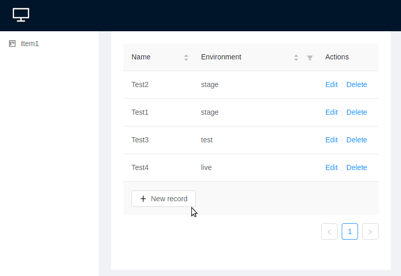

# Starter template for React + Ant.Design

The bundle represents a manageable data table UI (sorting/filtering and pagination) based on React + Ant.Design
provided with backend driven by Express.js + MySQL



## Set up
1) Clone this repo
2) Create `.env` in the project directory
```
DEMO_NODE_SERVER_HOST=127.0.0.1
DEMO_NODE_SERVER_PORT=9100
DEMO_DB_USER="username"
DEMO_DB_PASS="userpassword"
DEMO_DB_HOST="localhost"
DEMO_DB_NAME="react_antd"
```
3) Create DB as given in `.env` ( e.g. `react_antd` )
4) Initialize, migrate, build and start
```
npm i
npm run migrate:up
npm run build
npm start
```

## Available Automation Commands
- `npm run build` - build app
- `npm run watch` - start and watch for updates in the code base
- `npm start` - start app
- `npm run migrate:up` - run all available migrations up to the latest one
- `npm run migrate:down` - rollback migration

# Examples
- Redux from client-side `./frontend/src/Components/Head/Head.jsx`
- Redux from server-side `./backend/Router/Render/index.jsx`
- Prefetching a component `./frontend/src/Containers/App.jsx`
- Configure routes for both server and client sides `./frontend/src/Containers/App.jsx`